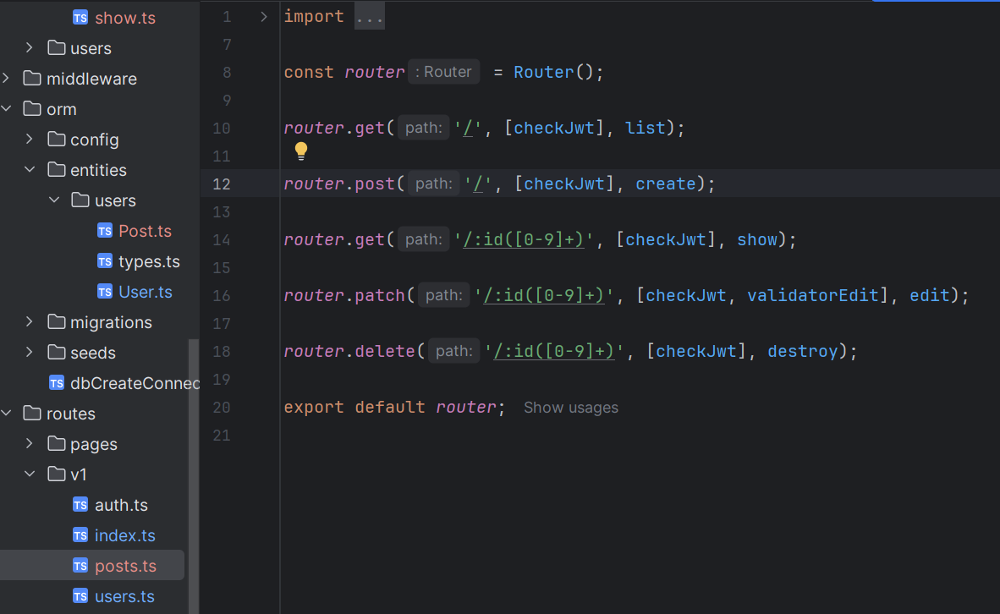

<h2>1. Створити нову сутність Post:</h2>
Визначити поля:

- **id**: UUID, первинний ключ  
- **title**: рядок, обов’язковий  
- **content**: текст, необов’язковий  
- **createdAt**: дата створення, автоматично заповнюється  
- **updatedAt**: дата оновлення, автоматично оновлюється

<h2>2. Створити та застосувати міграцію:</h2>
- Згенерувати міграцію для нової сутності.
- Запустити міграцію через CLI.
- Перевірити у базі даних (наприклад, через pgAdmin або консоль), що структура таблиці відповідає очікуваній.

<h2>3. Реалізувати RESTful API для CRUD-операцій:</h2>

- **Create**: створення нового поста
- **Read**:
    -   отримання всіх постів
    -   отримання одного поста за ID
- **Update**: оновлення поста за ID
- **Delete**: видалення поста за ID
-   Використовувати контролер, DTO, роутер та сервіс за прикладом реалізації для User.

<h2>4. [Опціонально, для підвищення оцінки] Налагодити зв’язок між User і Post:</h2>

-   Один користувач може мати багато постів.
-   У моделі Post додати поле user з типом ManyToOne, що вказує на User.
-   У моделі User додати поле posts з типом OneToMany.
-   При відповіді через API:
    -   у кожному пості має бути вкладена інформація про користувача (без пароля),
    -   у відповіді на запит користувача — масив його постів.

<h2>5. Протестувати REST API через Postman:</h2>

-   Створити окрему колекцію для запитів.
-   Додати приклади:
    -   створення поста,
    -   отримання всіх постів,
    -   отримання поста за ID,
    -   оновлення поста,
    -   видалення поста,
    -   [опціонально] отримання постів разом із користувачем та навпаки.
-   Переконатися, що кожен ендпоінт працює відповідно до очікувань.

