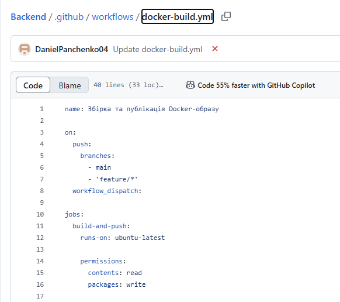
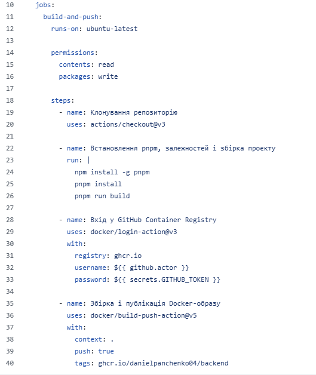
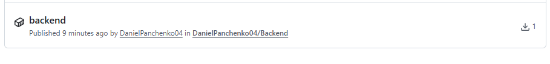

<h2>1. Завершити наступні практичні роботи на GitHub Skills, надати посилання на репозиторії з виконаним завданням у звіті</h2>

- [Hello GitHub Actions](https://github.com/DanielPanchenko04/skills-hello-github-actions)
- [Publish Packages](https://github.com/DanielPanchenko04/skills-publish-packages1)

<h2>2.1. Створити воркфлоу з двома тригерами</h2>

- тригер за ручним вкиликом
- тригер за пушем коміту в наступні гілки:
  - main
  - feature/\*

<h2>2.2. Воркфлоу має містити 1 job з наступними кроками всередині:</h2>

- Клонування репозиторію з налаштуваннями за замовчуванням(див.actions/checkout)
- Встановлення pnpm за допомогою npm install, встановлення залежностей за допомогою pnpm install, та збірку проєкту за допомогою pnpm run build.
  - Зазначені команди цього пункту мають бути виконані в одному скрипті
- Авторизацію в GitHub Container Registry(див docker/login-action)
  - вказати ghcr.io. в полі registry
  - вказати власне ім‘я користувача в полі username(
    - додатково: використайте значення з github context
  - вказати вбудований GITHUB_TOKEN в якості паролю
- Збірку та завантаження Докер-образу в GitHub container registry(див docker/build-push-action)
  - Вказати поточну директорію в полі context
  - Встановити в полі push значення true
  - Встановити tag наступного вигляду: ghcr.io/{{ваш_логін}}/{{ім‘я_репозиторію}}
    - Логін та ім‘я репозиторію отримати з github context

<h2>2.3. Перейти в свій акаунт GitHub на вкладку Packages та пересвідчитися що там відображено Ваш Докер-образ </h2>

